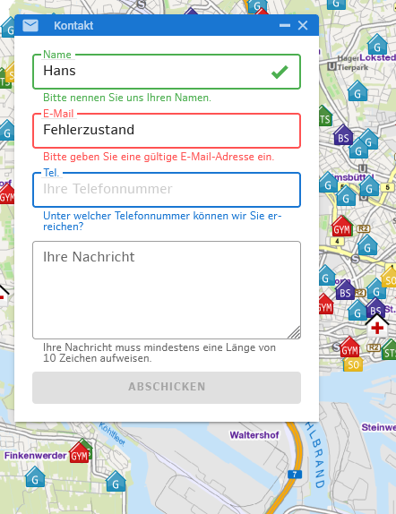

# Vuetify im Masterportal

Erfahrung mit der Installation und ersten Nutzung von Vuetify im Masterportal.
Kurze Übersicht:

**Vorteile**:
- automatisch erzeugte Accessibility
- Vorgefertige Komponenten
- einfache Installation
- "sieht besser aus"
- Forms
    - Validation einfacher
    - Einfügen von Hinweisen, Icons, etc... einfacher
    - Status "success", "error" verfügbar
- [Theming](https://vuetifyjs.com/en/features/theme/)
  - Unterstützt von sich aus Light/Dark Mode
  - Es gibt eine zentrale Stelle zum Überschreiben des Themes - man könnte es so IP-Partnern ermöglichen ihr Masterportal farblich umzugestalten, wenn man die Vuetify-Farben konsequent nutzt

**Nachteile**:
- Noch kein weg gefunden vuetify zu testen (muss in einer globalen Setup-Datei initiallisiert werden)
    - Selects nicht einfach in v-select konvertierbar, da anderes Verhalten oder Aufbau
    - Tests müssen ebenfalls angepasst werden, da diese teilweise mit ``select`` und ``option`` arbeiten
- Boilerplate-Code durch Helperfunctions
- Konflikte der CSS-Klassen (Bsp.: "input-sm", Hintergrundbild)


## Installation

Vuetify ließ sich einfach anhand der [Installationsanweisung](https://vuetifyjs.com/en/getting-started/installation/#webpack-install) der Website ins bestehende Projekt installieren. Damit die bereitgestellten Komponenten funktionieren, musste jedoch noch die Vue-App mit dem **v-app** Tag gewrappt werden.


## Scale Switcher

Eins der meist genutzen "Input"-Elemente im Masterportal ist das Select-Tag. Vuetify bringt sein eigenes Select-Tag [v-select](https://vuetifyjs.com/en/components/selects/) mit, welches ich versuchsweise im **ScaleSwitcher** implementiert habe.
Dies erzeugt automatisch eigene Ids, ein ``aria-selected`` und eine ``role`` Attribut.

Im eigentlichen HTML wird jedoch kein ``select`` oder ``option`` Tag verwendet sondern nur divs. Somit entfallen auch teilweise Html-Attribute, wie zum Beispiel der Index der momentan ausgewählten Option, welche über neue Helferfunktion in Vue wiederhergestellt werden müssen.

Des Weiteren lässt sich die Textdarstellung nicht ohne weiteres bearbeiten. Hierzu müssen die darzustellenden Objekte ein Attribut ``text`` besitzten, in dem der Darstellungsstring enthalten ist (siehe Bsp).

Bsp.:

Vue Code:
```html
<select
    id="scale-switcher-select"
    v-model="scale"
    class="font-arial form-control input-sm pull-left"
    @change="setResolutionByIndex($event.target.selectedIndex)"
>
    <option
        v-for="(scaleValue, i) in scales"
        :key="i"
        :value="scaleValue"
    >
        1 : {{ scaleValue }}
    </option>
</select>
```
Generiertes HTML:
```html
<select data-v-3a4d10cb="" data-v-2a3dd68d="" id="scale-switcher-select" class="font-arial form-control input-sm pull-left">
    <option data-v-3a4d10cb="" data-v-2a3dd68d="" value="250000">
        1 : 250000
    </option>
    <option data-v-3a4d10cb="" data-v-2a3dd68d="" value="100000">
        1 : 100000
    </option
    ><option data-v-3a4d10cb="" data-v-2a3dd68d="" value="60000">
        1 : 60000
    </option>
    ...
</select>
```

Vuetify Code:
```html
<script>

computed: {
    formattedScales: function () {
            return this.scales.map(scale => {
                return {
                    text: "1:" + scale,
                    value: scale
                };
            });
    }, ...
}

methods: {
    setResolutionWrapper (value) {
        this.setResolutionByIndex(this.scales.indexOf(value));
    }, ...
}
...
</script>


<template>
    <v-select
        id="scale-switcher-select"
        v-model="scale"
        label="Maßstab"
        :items="scales"
        return-object
        @change="setResolutionWrapper($event)"
    />
</template>
```
Generiertes HTML:
```html
<div role="listbox" tabindex="-1" class="v-list v-select-list v-sheet theme--light theme--light" data-v-3a4d10cb="true" id="list-50">
    <div tabindex="0" aria-selected="false" id="list-item-61-0" role="option" class="v-list-item v-list-item--link theme--light">
        1:250000
    </div>
    <div tabindex="0" aria-selected="false" id="list-item-61-1" role="option" class="v-list-item v-list-item--link theme--light">
        1:100000
    </div>
    <div tabindex="0" aria-selected="true" id="list-item-61-2" role="option" class="v-list-item primary--text v-list-item--active v-list-item--link theme--light v-list-item--highlighted">
        1:60000
    ...
    </div>
</div>
```

## Contact

Als zweite Komponente hab ich mir die Forms in dem **Contact** Tool angeguckt. Hier wird eine Validation durchgeführt und je nach Ergebnis Hinweise oder Erfolgsmeldung angezeigt.  Der Erfolg der Validation wird durch das Erscheinen eines Häckchen dargestellt. Das Einfügen von Symbolen in Vuetify ist besonders einfach. Sie werden als Props in die Komponente hineingegeben. Man kann sie jeweils inner- oder außerhalb vor oder hinter des Inputs platzieren. Vuetify unterstüzt außerdem verschiedenste Icon Bibliotheken wie Martieral Icons oder FontAwesome. Des Weiteren lassen sich die Input-Elemente in verschiedene Stati setzten, wie "error" oder "success".

Der Template Code schrumpft um einiges zusammen, wird lesbarer und beinhaltet mehr Funktionen.

Vue Code:
```html
<template>
    <div
        :class="[
            'form-group',
            'has-feedback',
            validInput ? 'has-success' : '',
            !validInput && inputValue ? 'has-error' : ''
        ]"
    >
        <div :class="htmlElement === 'input' ? 'input-group' : ''">
            <label
                :class="[
                    'control-label',
                    'input-group-addon',
                    htmlElement === 'textarea' ? 'force-border' : ''
                ]"
                :for="`tool-contact-${inputName}-input`"
            >{{ labelText }}</label>
            <component
                :is="htmlElement"
                :id="`tool-contact-${inputName}-input`"
                :value="inputValue"
                :type="htmlElement === 'input' ? inputType : ''"
                class="form-control"
                :aria-describedby="`tool-contact-${inputName}-help`"
                :placeholder="$t(`common:modules.tools.contact.placeholder.${inputName}`)"
                :rows="htmlElement === 'textarea' ? rows : ''"
                @keyup="changeFunction($event.currentTarget.value)"
            />
        </div>
        <span
            v-if="validInput"
            :class="[
                'glyphicon',
                'glyphicon-ok',
                'form-control-feedback',
                htmlElement === 'textarea' ? 'lift-tick' : ''
            ]"
            aria-hidden="true"
        />
        <span
            v-else
            :id="`tool-contact-${inputName}-help`"
            class="help-block"
        >
            {{ $t(
                `common:modules.tools.contact.error.${inputName + (inputName === "message" ? "Input" : "")}`,
                {length: minMessageLength}
            ) }}
        </span>
    </div>
</template>
```

Vuetify Code:

```html
<template>
    <component
        :is="htmlElement"
        :id="`tool-contact-${inputName}-input`"
        :label="labelText"
        :value="inputValue"
        :rules="[validInput]"
        :messages="$t(
            `common:modules.tools.contact.error.${inputName + (inputName === 'message' ? 'Input' : '')}`,
            {length: minMessageLength}
        )"
        :append-icon="validInput ? 'mdi-check-bold' : ''"
        :aria-describedby="`tool-contact-${inputName}-help`"
        :placeholder="$t(`common:modules.tools.contact.placeholder.${inputName}`)"
        :rows="htmlElement === 'v-textarea' ? rows : ''"
        class="control-label"
        outlined
        @keyup="changeFunction($event.currentTarget.value)"
    />
</template>
```


## Cards

Die Tool-Fenster könnten sich als Cards darstellen lassen. Allerdings ist Gestaltung von Cards sehr offen gehalten. Es gibt keine Card-Header-, Card-Body-, oder Card-Footer-Tags. Testweise habe ich die Tool Komponente mit einer Card und anderen Vuetify-Komponenten umgebaut.


